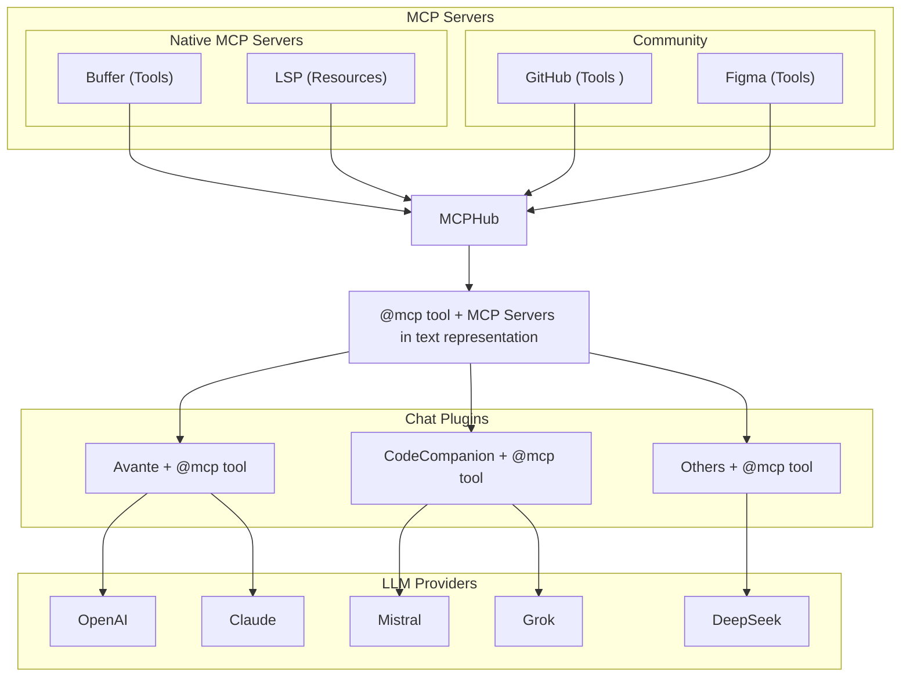
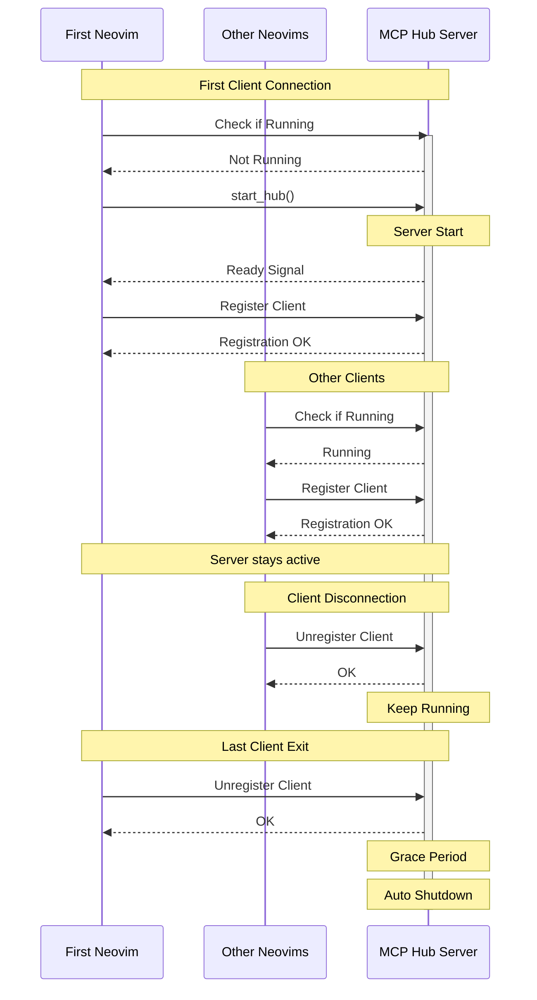
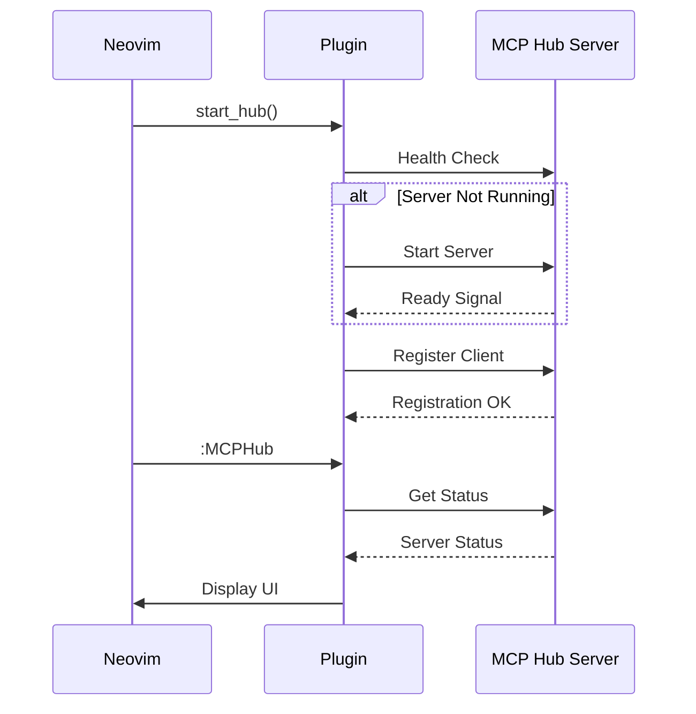
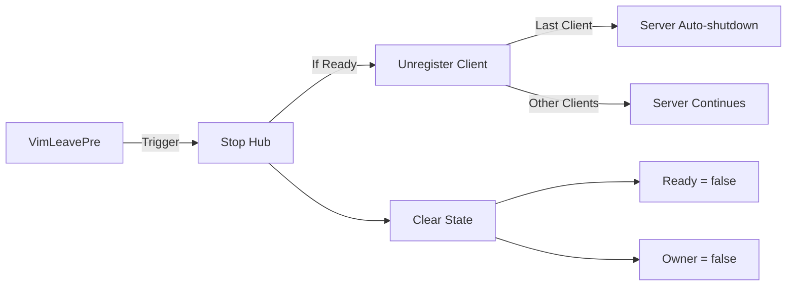
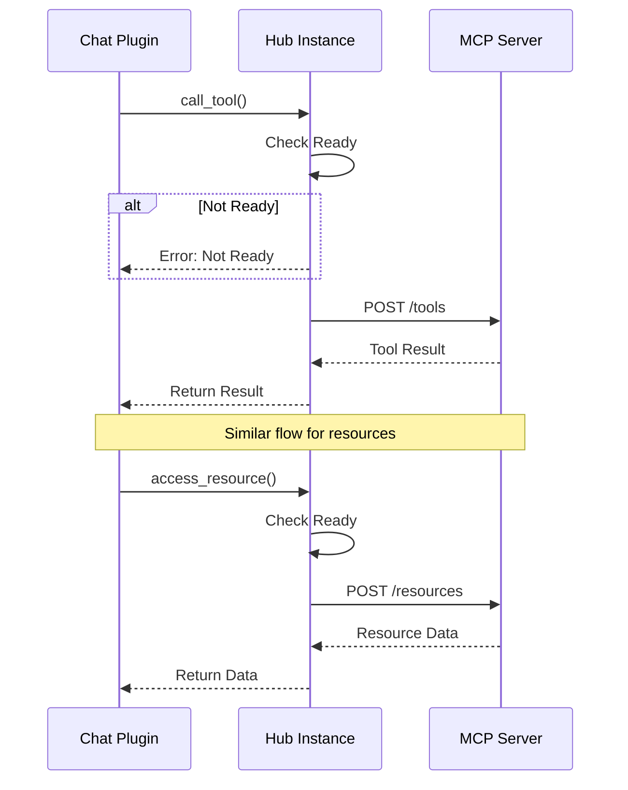

# MCP Hub

[](https://www.lua.org)
[](https://nixos.org)
[](https://opensource.org/licenses/MIT)
[](https://discord.gg/NTqfxXsNuN)

A powerful Neovim plugin that integrates MCP (Model Context Protocol) servers into your workflow. Configure and manage MCP servers through a centralized config file while providing an intuitive UI for browsing, installing and testing tools and resources. Perfect for LLM integration, offering both programmatic API access and interactive testing capabilities through the `:MCPHub` command.

**Discord**: Join our [Discord server](https://discord.gg/NTqfxXsNuN) for discussions, help, and updates



<div align="center">
<p>
<h4>MCPHub + <a href="https://github.com/yetone/avante.nvim">Avante</a> + Figma </h4>
<video controls muted src="https://github.com/user-attachments/assets/e33fb5c3-7dbd-40b2-bec5-471a465c7f4d"></video>
</p>
</div>

<details>
<summary>Video Demos</summary>
<div align="center">
<p>
<h4>Using <a href="https://github.com/olimorris/codecompanion.nvim">codecompanion</a></h4>
<video controls muted src="https://github.com/user-attachments/assets/cefce4bb-d07f-4423-8873-cf7d56656cd3"></video>
</p>
</div>
<div align="center">
<p>
<h4>🎉 Marketplace </h4>
<video controls muted src="https://github.com/user-attachments/assets/20a18abc-f2ba-436e-aab7-ea795f6e28d2"></video>
</p>
</div>

</details>

## :raised_hands: Support MCPHub

MCPHub is an open source project that relies on your support. If you like this project, please consider supporting to help maintain and improve the project by [Sponsoring](https://github.com/sponsors/ravitemer) or :coffee: [Buying A Coffee](https://www.buymeacoffee.com/ravitemer)

### :purple_heart: Sponsors

Thank you to the following amazing people:

<p align="center">

<a href="https://github.com/yingmanwumen"></a>
<a href="https://github.com/yetone"></a>
<a href="https://github.com/omarcresp"></a>
<a href="https://github.com/petermoser"></a>
<a href="https://github.com/watsy0007"></a>

</p>

## ✨ Features & Support Status

| Category | Feature | Support | Details |
|----------|---------|---------|-------|
| [**Capabilities**](https://modelcontextprotocol.io/specification/2025-03-26/server) ||||
| | Tools | ✅ | Full support |
| | 🔔 Tool List Changed | ✅ | Real-time updates |
| | Resources | ✅ | Full support |
| | 🔔 Resource List Changed | ✅ | Real-time updates |
| | Resource Templates | ✅ | URI templates |
| | Prompts | ✅ | Full support |
| | 🔔 Prompts List Changed | ✅ | Real-time updates |
| | Roots | ❌ | Not supported |
| | Sampling | ❌ | Not supported |
| **MCP Server Transports** ||||
| | [Streamable-HTTP](https://modelcontextprotocol.io/specification/2025-03-26/basic/transports#streamable-http) | ✅ | Primary transport protocol for remote servers |
| | [SSE](https://modelcontextprotocol.io/specification/2025-03-26/basic/transports#backwards-compatibility) | ✅ | Fallback transport for remote servers |
| | [STDIO](https://modelcontextprotocol.io/specification/2025-03-26/basic/transports#stdio) | ✅ | For local servers |
| **Authentication for remote servers** ||||
| | [OAuth](https://modelcontextprotocol.io/specification/2025-03-26/basic/authorization) | ✅ | With PKCE flow |
| | Headers | ✅ | For API keys/tokens |
| **Chat Integration** ||||
| | [Avante.nvim](https://github.com/yetone/avante.nvim) | ✅ | Tools, resources, resourceTemplates, prompts(as slash_commands) |
| | [CodeCompanion.nvim](https://github.com/olimorris/codecompanion.nvim) | ✅ | Tools, resources, resourceTemplates, prompts (as slash_commands) | 
| | [CopilotChat.nvim](https://github.com/CopilotC-Nvim/CopilotChat.nvim) | ✅ | In-built support [Draft](https://github.com/CopilotC-Nvim/CopilotChat.nvim/pull/1029) | 
| **Marketplace** ||||
| | Server Discovery | ✅ | Browse from verified MCP servers |
| | Installation | ✅ | Manual and auto install with AI |
| **Advanced** ||||
| | Smart File-watching | ✅ | Smart updates with config file watching |
| | Multi-instance | ✅ | All neovim instances stay in sync |
| | Shutdown-delay | ✅ | Can run as systemd service with configure delay before stopping the hub |
| | Lua Native MCP Servers | ✅ | Write once , use everywhere. Can write tools, resources, prompts directly in lua |


<details>
<summary><strong>Native MCP Server Support</strong></summary>

- Create Lua-based MCP servers directly in Neovim ([detailed guide](lua/mcphub/native/NATIVE_SERVER_LLM.md))
- Automatically create lua native MCP servers using LLMs with built-in templates
- Write once, use everywhere design
- Clean chained API for tools, resources, and prompts
- Full URI-based resource system with templates
- Chat-style prompts with role management
- Centralized lifecycle management
</details>

<details>
<summary><strong>Built-in MCP Servers</strong></summary>

- **Neovim Server**: Pre-configured with essential development tools
- File operations (read, write, search, replace)
- Command execution and terminal integration
- LSP integration with diagnostics
- Buffer and environment access
- Interactive chat prompts
- Can be disabled if not needed
</details>


<details>
<summary><strong>Chat Plugin Integration</strong></summary>

- Deep integration with popular Neovim chat plugins:
  - Avante.nvim: Full MCP tool support with auto-approval option
  - CodeCompanion.nvim: MCP resources as chat variables and slash commands for prompts
  - Real-time variable updates when servers change
  - Automatic resource syncing and prompt registration
  - Example: MCP resources as chat variables, prompts as slash_commands
</details>

<details>
<summary><strong>Marketplace Integration</strong></summary>

- Browse available MCP servers with details and stats
- Sort, filter by category, and search servers
- View server documentation and installation guides
- One-click installation via Avante/CodeCompanion
</details>
<details>
<summary><strong>Interactive Testing</strong></summary>

- Real-time tool testing interface
- Resource browsing and access
- Built-in documentation and help
</details>
<details>
<summary><strong>Performance and Reliability</strong></summary>

- Full multi-instance support with synchronized state
- Configuration file watching with real-time updates
- Smart shutdown handling (configurable delay)
- Parallel startup for improved performance
- Automatic server lifecycle management
</details>

<details>
<summary><strong>Developer-friendly</strong></summary>

- Both sync and async operations supported
- Clean client registration/cleanup
- Comprehensive API for tool and resource access
</details>

## 📦 Installation

Using [lazy.nvim](https://github.com/folke/lazy.nvim):

```lua
{
    "ravitemer/mcphub.nvim",
    dependencies = {
      "nvim-lua/plenary.nvim",  -- Required for Job and HTTP requests
    },
    -- uncomment the following line to load hub lazily
    --cmd = "MCPHub",  -- lazy load 
    build = "npm install -g mcp-hub@latest",  -- Installs required mcp-hub npm module
    -- uncomment this if you don't want mcp-hub to be available globally or can't use -g
    -- build = "bundled_build.lua",  -- Use this and set use_bundled_binary = true in opts  (see Advanced configuration)
    config = function()
      require("mcphub").setup()
    end,
}
```
### Advanced Configuration
<details>
<summary>Default Config</summary>

All options are optional with sensible defaults. Here's a complete example with all available options:

```lua
require("mcphub").setup({
    port = 37373, -- Default port for MCP Hub
    config = vim.fn.expand("~/.config/mcphub/servers.json"), -- Absolute path to config file location (will create if not exists)
    native_servers = {}, -- add your native servers here

    auto_approve = false, -- Auto approve mcp tool calls
    auto_toggle_mcp_servers = true, -- Let LLMs start and stop MCP servers automatically
    -- Extensions configuration
    extensions = {
        avante = {
            make_slash_commands = true, -- make /slash commands from MCP server prompts
        },
        codecompanion = {
            show_result_in_chat = true, -- Show the mcp tool result in the chat buffer
            make_vars = true, -- make chat #variables from MCP server resources
            make_slash_commands = true, -- make /slash commands from MCP server prompts
        },
    },


    -- Default window settings
    ui = {
        window = {
            width = 0.8, -- 0-1 (ratio); "50%" (percentage); 50 (raw number)
            height = 0.8, -- 0-1 (ratio); "50%" (percentage); 50 (raw number)
            relative = "editor",
            zindex = 50,
            border = "rounded", -- "none", "single", "double", "rounded", "solid", "shadow"
        },
        wo = { -- window-scoped options (vim.wo)
        },
    },

    -- Event callbacks
    on_ready = function(hub)
        -- Called when hub is ready
    end,
    on_error = function(err)
        -- Called on errors
    end,

    --set this to true when using build = "bundled_build.lua"
    use_bundled_binary = false, -- Uses bundled mcp-hub script instead of global installation

    --WARN: Use the custom setup if you can't use `npm install -g mcp-hub` or cant have `build = "bundled_build.lua"`
    -- Custom Server command configuration
    --cmd = "node", -- The command to invoke the MCP Hub Server
    --cmdArgs = {"/path/to/node_modules/mcp-hub/dist/cli.js"},    -- Additional arguments for the command
    -- In cases where mcp-hub server is hosted somewhere, set this to the server URL e.g `http://mydomain.com:customport` or `https://url_without_need_for_port.com`
    -- server_url = nil, -- defaults to `http://localhost:port`
    -- Multi-instance Support
    shutdown_delay = 600000, -- Delay in ms before shutting down the server when last instance closes (default: 10 minutes)

    -- Logging configuration
    log = {
        level = vim.log.levels.WARN,
        to_file = false,
        file_path = nil,
        prefix = "MCPHub",
    },
})
```
</details>

<details>
<summary><code>~/.config/mcphub/servers.json</code></summary>

MCPHub uses a JSON configuration file to define MCP servers. The default location is `~/.config/mcphub/servers.json`.

#### Example Configuration

```js
{
  "mcpServers": {
    "fetch": {
      "command": "uvx",
      "args": ["mcp-server-fetch", "$API_KEY"], //replaces $API_KEY with API_KEY from env field
      "env": {
        "API_KEY": "",                 // Falls back to process.env.API_KEY
        "SERVER_URL": null,            // Falls back to process.env.SERVER_URL
        "DEBUG": "true"               // Direct value, no fallback
      }
    },
    "remote-server": {
      "url": "https://api.example.com/mcp", // Auto determine streamable-http or sse, Auto OAuth authorization
      "headers": {                          // Explicit headers
        "Authorization": "Bearer your-token"
      }
    }
  }
}
```

Configuration file (`~/.config/mcphub/servers.json`) is watched for changes and updates are applied automatically in real-time across all Neovim instances.
</details>

##### MCP Servers Config

`mcphub.nvim` supports both `stdio` (local) MCP Servers as well as `sse` (remote) MCP Servers. The configuration for each type is as follows:

* Local Stdio Servers:
    - `command`: The command to start the MCP server (required)
    - `args`: Command arguments as array (replaces args starting with `$` from env)
    - `env`: Optional environment variables. Special values:
      - `""` (empty string): Falls back to process.env.[VAR_NAME]
      - `null`: Falls back to process.env.[VAR_NAME]
      - Any other value is used as-is

* Remote Servers: (Supports `streamable-http`, `sse` with `OAuth`)
    - `url`: url for remote MCP Server (required) (Auto determines streamable-http or sse transport, auto OAuth authorization)
    - `headers`: Optional headers for the server

* There are other plugin specific options for each server like `disabled`, `disabled_tools`, `custom_instructions` etc which can be easily updated from the UI.


## 🚀 Usage

Open the MCPHub UI to manage servers, test tools and monitor status:

```vim
:MCPHub
```
<details>
<summary>For Chat plugin Devs: Use hub instance api in your code</summary>

```lua
local hub = mcphub.get_hub_instance()

-- Call a tool (sync)
  local response, err = hub:call_tool("server-name", "tool-name", {
      param1 = "value1"
      }, {
      return_text = true -- Parse response to LLM-suitable text
      })

-- Call a tool (async)
  hub:call_tool("server-name", "tool-name", {
      param1 = "value1"
      }, {
      return_text = true,
      callback = function(response, err)
      -- Use response
      end
      })

-- Access resource (sync)
  local response, err = hub:access_resource("server-name", "resource://uri", {
      return_text = true
      })

-- Get prompt helpers for system prompts
local prompts = hub:generate_prompts()
-- prompts.active_servers: Lists currently active servers
-- prompts.use_mcp_tool: Instructions for tool usage with example
-- prompts.access_mcp_resource: Instructions for resource access with example
```
</details>

## 🔌 Extensions

MCPHub.nvim provides extensions that integrate with popular Neovim chat plugins. These extensions allow you to use MCP tools and resources directly within your chat interfaces.

<details>
<summary>

### Avante.nvim

</summary>

Add MCP capabilities to Avante by including the MCP tools in your setup:

> Set `config.auto_approve = true` or `vim.g.mcphub_auto_approve = true` to automatically approve mcp tool requests.

> Set `config.extensions.avante.make_slash_commands = true` to enable prompts as slash commands (enabled by default).
Server prompts will be available as `/mcp:server_name:prompt_name` in chat.

The `mcp_tool()` function now returns two separate tools (`use_mcp_tool` and `access_mcp_resource`) for better schema generation:

```lua
require("mcphub").setup({
    extensions = {
        avante = {
            make_slash_commands = true, -- make /slash commands from MCP server prompts
        }
    }
})
```

```lua
require("avante").setup({
    -- other config
    -- The system_prompt type supports both a string and a function that returns a string. Using a function here allows dynamically updating the prompt with mcphub
    system_prompt = function()
        local hub = require("mcphub").get_hub_instance()
        return hub:get_active_servers_prompt()
    end,
    -- The custom_tools type supports both a list and a function that returns a list. Using a function here prevents requiring mcphub before it's loaded
    custom_tools = function()
        return {
            require("mcphub.extensions.avante").mcp_tool(),
        }
    end,
})
```


⚠️ **Tool Conflicts**: [Disable any built-in Avante tools](https://github.com/yetone/avante.nvim#disable-tools) that might conflict with enabled MCP servers to prevent duplicate functionality or unexpected behavior.

If you are using the builtin Neovim server, you might have to disable the following tools in your avante config to avoid any conflicts.

```lua
disabled_tools = {
    "list_files",
    "search_files",
    "read_file",
    "create_file",
    "rename_file",
    "delete_file",
    "create_dir",
    "rename_dir",
    "delete_dir",
    "bash",
},
```
</details>

<details>
<summary>

### Codecompanion

</summary>

Add MCP capabilities to CodeCompanion.

> Set `config.auto_approve = true` or `vim.g.mcphub_auto_approve = true` to automatically approve tool requests.

> Set `make_vars = true` to show resources as #variables in the chat buffer

> Set `make_slash_commands = true` to show prompts as /slash_commands in the chat buffer

- Type @mcp in the chat (once submitted, it will add available MCP Servers to the system prompts and adds a tool so that the LLM can call tools, resources on MCP Servers etc)
- Server prompts become available as `/mcp:prompt_name` slash commands in chat (*Currently very few servers provide prompts, but you can add your own using `mcphub.add_prompt`*)
- Prompts with arguments are handled using vim.ui.input (cancelling input for required arguments will abort the slash command)
- If the last message from the `/mcp:prompt_name` message is of `user` role, it will be added to the chat buffer. 

* Whenever the servers are updated, the variables and slash_commands will also be updated in realtime


* E.g LSP current file diagnostics


 


> Set `show_result_in_chat = true` to view the mcp tool call result in the chat buffer. 

```lua

require("mcphub").setup({
    extensions = {
        codecompanion = {
            -- Show the mcp tool result in the chat buffer
            show_result_in_chat = true,
            make_vars = true, -- make chat #variables from MCP server resources
            make_slash_commands = true, -- make /slash_commands from MCP server prompts
        },
    }
})
```

```lua
require("codecompanion").setup({
    strategies = {
        chat = {
            tools = {
                ["mcp"] = {
                    -- calling it in a function would prevent mcphub from being loaded before it's needed
                    callback = function() return require("mcphub.extensions.codecompanion") end,
                    description = "Call tools and resources from the MCP Servers",
                }
            }
        }
    }
})

```
</details>


<details>
<summary>

### Lualine

</summary>

```lua
require('lualine').setup {
    sections = {
        lualine_x = {
            {require('mcphub.extensions.lualine')},
        },
    },
}
```

When connecting show warning state.


When idle shows total number of connected servers.


When a tool or resources is being called, shows spinner. 


</details>


---

<details>
<summary>

## 🎉Lua Native MCP Servers ([detailed guide](lua/mcphub/native/NATIVE_SERVER_LLM.md))
</summary>

### Why Use Native MCP Servers?

### The Challenge

Many Neovim chat plugins like Avante and CodeCompanion already provide ways to add custom tools:

```lua
-- Avante's custom tools
require("avante").setup({
    custom_tools = {
        get_weather = {
            name,
            description,
            param,
            returns,
            func
        }
    }
})
-- CodeCompanion's tools 
require("codecompanion").setup({
    chat = {
        tools = {
            get_weather = {
                 name,
                 description,
                 cmds,
                 schema,
                 output,
            }
        }
    }
})

```

This leads to several limitations:

| Feature | Regular tools | MCPHub Native Servers |
|---------|-------------------------|----------------------|
| Implementation | Needs reimplementing for each plugin | Write once, works everywhere |
| Api | Needs plugin specific docs | Intuitive chained api `res:text():image():send()` |
| Instructions | Can't have long `schema.description` | Tools,Resources converted to system prompt, instructions in one place |
| Resources Support | No built-in resource handling | Full URI-based resource system |
| Response Types | No standard types | MCP standard types (text, images, blobs) |
| State Management | Per-plugin implementation | Centralized lifecycle management |
| Plugin Updates | May break tool implementations | Tools isolated from plugin changes |

### MCPHub Solution
MCPHub solves these problems by providing a standardized protocol (MCP) and a central hub for tools and resources:

**MCPHub Native MCP Server**

<details><summary> <strong> Option 1 (Static):</strong> add server schema table upfront in <code>config.native_servers</code></strong></summary>

```lua
-- Complete server definition with tool, resource, and template
native_servers = { 
 weather = {
    name = "weather",
    capabilities = {
        tools = {
            {
                name = "get_weather",
                description = "Get current weather information for a city",
                inputSchema = {
                    type = "object",
                    properties = {
                        city = {
                            type = "string",
                            description = "City name to get weather for",
                        }
                    },
                },
                handler = function(req, res)
                    res:text("Weather in " .. req.params.city .. ": ☀️ Sunny, 22°C"):send()
                end
            }
        },
        resources = {
            {
                name = "current",
                uri = "weather://current/london",
                description = "Get current weather data for London",
                handler = function(req, res)
                    res:text("London: ☀️ Sunny, 22°C, Humidity: 65%"):send()
                end
            }
        },
        resourceTemplates = {
            {
                name = "city_weather",
                uriTemplate = "weather://forecast/{city}",
                description = "Get weather forecast for any city",
                handler = function(req, res)
                    res:text(req.params.city .. " 5-day forecast:\n" ..
                           "Mon: ☀️ 22°C\n" ..
                           "Tue: ⛅ 20°C\n" ..
                           "Wed: 🌧️ 18°C"):send()
                end
            }
        },
        prompts = {
            name = "weather_chat",
            description = "Chat about weather in any city",
            arguments = {
                {
                    name = "city",
                    description = "City to check weather for"
                }
            },
            handler = function(req, res)
                return res
                :user()
                :text(string.format("What's the weather like in %s?", req.params.city))
                :llm()
                :text(string.format("Let me check the weather in %s for you...", req.params.city)):text(string.format("The weather in %s is ☀️ 22°C. Perfect day for outdoor activities!", req.params.city))
                    
                res:send()
            end
}
    }
  }
}
```
</details>

<details>
<summary> <strong> Option 2 (Dynamic) : Use<code>mcphub.add_*</code> api to build incrementally</strong></summary>

```lua
local mcphub = require("mcphub")

-- Start by adding a tool. It iwll create the server if it is not already present.
mcphub.add_tool("weather", {
  --tool def
})

-- Add a static resource for London weather
mcphub.add_resource("weather", {
  --resource def
})

-- Add a template for any city
mcphub.add_resource_template("weather", {
  --resource template def
})

-- Add a prompt
mcphub.add_prompt({
    --prompt def
})
```

</details>

Preview:


> Please read [Native README.md](https://github.com/ravitemer/mcphub.nvim/blob/native-servers/lua/mcphub/native/README.md) (beta) for more information.

MCPHub acts as a central hub that:
1. **Collects Tools, Resources, Prompts**: Gathers capabilities from both native and community servers
2. **Standardizes Access**: Provides a single interface via `@mcp` tool
3. **Manages State**: Handles server lifecycles and capability registration
4. **Formats Prompts**: Transforms complex tool definitions into LLM-friendly formats


#### Key Benefits

1. **Write Once, Use Everywhere**
   - Implement tools once as native servers
   - Works with any chat plugin that supports MCPHub
   - Chat plugins focus on their unique features

2. **No Limitations**

All tools, resources, and templates from the server above are converted into a clean, LLM-friendly system prompt:

```txt
## weather

### Available Tools
- get_weather: Get current weather information for a city
    Input Schema:
    {
        type: "object",
        properties: {
            city: {
                type: "string",
                description: "City name to get weather for",
                examples: ["London", "Tokyo"]
            }
        }
    }

### Available Resources
- weather://current/london: Get current weather data for London

### Resource Templates
- weather://forecast/{city}: Get weather forecast for any city
```

3. **Rich Resource Capabilities**
   - Static resources with URIs (like weather://current/london)
   - Dynamic resource templates (like weather://forecast/{city})
   - Resource embedding in tool responses
   - Consistent URI patterns across servers
4. **Separation of Concerns**
   - Tool providers focus on implementations
   - Chat plugins focus on LLM integration
   - MCPHub handles communication and standardization

5. **Easy Integration**
   - Chat plugins need only implement MCPHub support
   - Get access to all MCP servers automatically
   - Standardized tool and resource interfaces

6. **Community Ecosystem**
   - Share implementations across plugins
   - Reduce duplication of effort
   - Common platform for tool development

</details>


<details>
<summary>

## 🔨 Troubleshooting

</summary>

1. **Environment Requirements**

   - Ensure these are installed as they're required by most MCP servers:
     ```bash
     node --version    # Should be >= 18.0.0
     python --version  # Should be installed
     uvx --version    # Should be installed
     ```
   - Most server commands use `npx` or `uvx` - verify these work in your terminal
   
2. LLM Model Issues

   If the LLM isn't making correct tool calls:

   1. **Schema Support**
   - Models with function calling support (like claude-3.5) work best with Avante's schema format
   - Only top-tier models handle XML-based tool formats correctly
   - Consider upgrading to a better model if seeing incorrect tool usage

   2. **Common Tool Call Issues**
   - Missing `action` field
   - Incorrect `server_name`
   - Missing `tool_name` or `uri`
   - Malformed arguments

   3. **Recommended Models**
   - GPT-4o
   - Claude 3.5 Sonnet
   - Claude 3.7
   - Gemini 2.0 Flash
   - Gemini 2.0 Pro
   - Mistral Large


3. **Port Issues**

   - If you get `EADDRINUSE` error, kill the existing process:
     ```bash
     lsof -i :[port]  # Find process ID
     kill [pid]       # Kill the process
     ```

4. **Configuration File**

   - Ensure config path is absolute
   - Verify file contains valid JSON with `mcpServers` key
   - Check server-specific configuration requirements
   - Validate server command and args are correct for your system

5. **MCP Server Issues**

   - Validate server configurations using either:
     - [MCP Inspector](https://github.com/modelcontextprotocol/inspector): GUI tool for verifying server operation
     - [mcp-cli](https://github.com/wong2/mcp-cli): Command-line tool for testing servers with config files
   - Check server logs in MCPHub UI (Logs view)
   - Test tools and resources individually to isolate issues

6. **Need Help?**
   - First try testing it with [minimal.lua](https://gist.github.com/ravitemer/c85d69542bdfd1a45c6a9849301e4388) 
   - Feel free to open an [Issue](https://github.com/ravitemer/mcphub.nvim/issues) for bugs or doubts
   - Create a [Discussion](https://github.com/ravitemer/mcphub.nvim/discussions) for questions, showcase, or feature requests

   </details>

<details>
<summary>

## 🔄 How It Works

</summary>

MCPHub.nvim uses an Express server to manage MCP servers and handle client requests:

1. When `setup()` is called:

   - Checks for mcp-hub command installation
   - Verifies version compatibility
   - Checks if server is already running (multi-instance support)
   - If not running, starts mcp-hub with config file watching enabled
   - Creates Express server at `http://localhost:[config.port]` or at `config.server_url`

2. After successful setup:

   - Calls on_ready callback with hub instance
   - Hub instance provides REST API interface 
   - Real-time UI updates via `:MCPHub` command
   - Configuration changes auto-sync across instances

3. Express Server Features:

   - Real-time config file watching and syncing
   - Manages MCP server configurations
   - Handles tool execution requests
   - Provides resource access
   - Multi-instance support with shared state
   - Automatic cleanup

4. When Neovim instances close:
   - Unregister as clients
   - Last client triggers shutdown timer
   - Timer cancels if new client connects

This architecture ensures:

- Consistent server management
- Real-time status monitoring
- Efficient resource usage
- Clean process handling
- Multiple client support

### Architecture Flows

##### Server Lifecycle



##### Request flow



##### Cleanup flow



##### API Flow


</details>

### Requirements

- Neovim >= 0.8.0
- Node.js >= 18.0.0
- [plenary.nvim](https://github.com/nvim-lua/plenary.nvim)
- [mcp-hub](https://github.com/ravitemer/mcp-hub) (automatically installed via build command)

## 🚧 TODO

- [x] Neovim MCP Server (kind of) with better editing, diffs, terminal integration etc (Ideas are welcome)
- [x] Enhanced help view with comprehensive documentation
- [x] MCP Resources as variables in chat plugins
- [x] MCP Prompts as slash commands in chat plugins
- [x] Enable LLM to start and stop MCP Servers dynamically
- [x] Support SSE transport
- [x] Support /slash_commands in avante
- [x] Support streamable-http transport
- [x] Support OAuth
- [ ] Support #variables in avante
- [ ] Better Docs and Wiki
- [ ] ~Composio Integration~
- [ ] ~Smithery Integration~


## 👏 Acknowledgements

Thanks to:

- [cline/mcp-marketplace](https://github.com/cline/mcp-marketplace) for providing the marketplace api
- [nui.nvim](https://github.com/MunifTanjim/nui.nvim) for inspiring our text highlighting utilities

## 📚 Documentation

For detailed documentation, visit our [Wiki](https://github.com/ravitemer/mcphub.nvim/wiki):

- [Installation Guide](https://github.com/ravitemer/mcphub.nvim/wiki/Installation)
- [Configuration Guide](https://github.com/ravitemer/mcphub.nvim/wiki/Configuration-File)
- [Extension Setup](https://github.com/ravitemer/mcphub.nvim/wiki/Extensions)
- [Avante Integration](https://github.com/ravitemer/mcphub.nvim/wiki/Avante)
- [CodeCompanion Integration](https://github.com/ravitemer/mcphub.nvim/wiki/CodeCompanion)
- [Lualine Integration](https://github.com/ravitemer/mcphub.nvim/wiki/Lualine)
- [Native MCP Servers](https://github.com/ravitemer/mcphub.nvim/wiki/Native-Servers)
- [Example Implementations](https://github.com/ravitemer/mcphub.nvim/wiki/Example-Servers)
- [API Reference](https://github.com/ravitemer/mcphub.nvim/wiki/API-Reference)
- [Troubleshooting Guide](https://github.com/ravitemer/mcphub.nvim/wiki/Troubleshooting)
