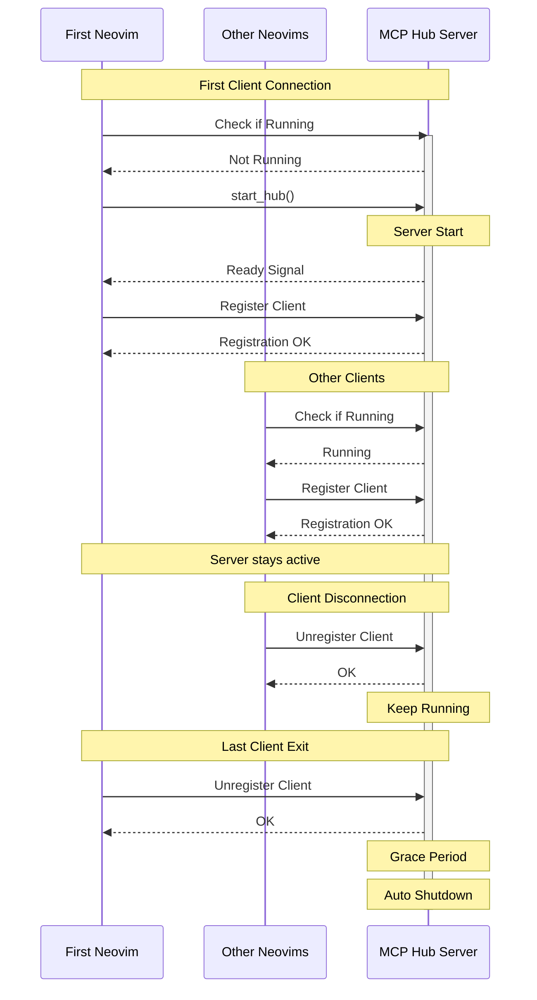
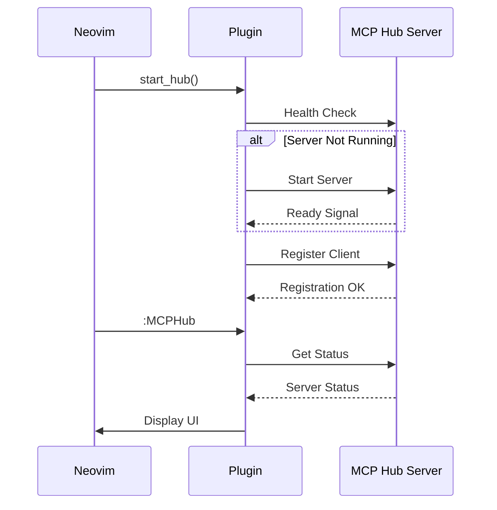
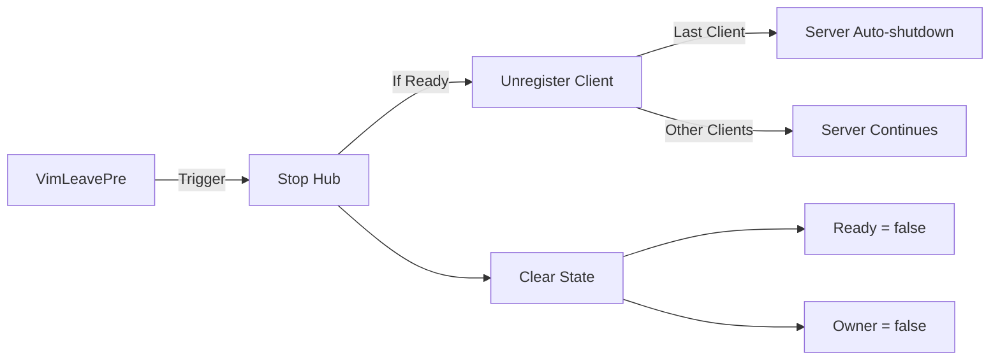
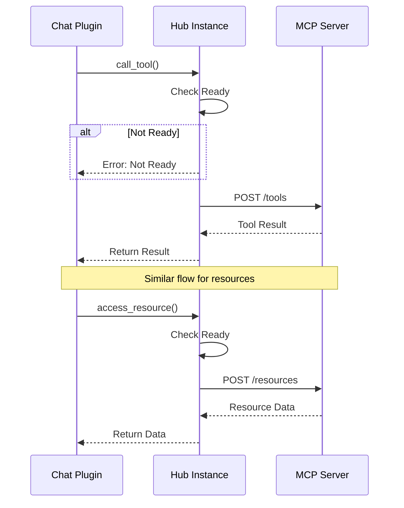

# How It Works

MCPHub.nvim uses an Express server to manage MCP servers and handle client requests:

1. When `setup()` is called:

   - Checks for mcp-hub command installation
   - Verifies version compatibility
   - Checks if server is already running (multi-instance support)
   - If not running, starts mcp-hub with config file watching enabled
   - Creates Express server at `http://localhost:[config.port]` or at `config.server_url`

2. After successful setup:

   - Calls `on_ready` callback with hub instance
   - Hub instance provides REST API interface 
   - Real-time UI updates via `:MCPHub` command
   - Configuration changes auto-sync across instances

3. Express Server Features:
   - Real-time config file watching and syncing
   - Manages MCP server configurations
   - Handles tool execution requests
   - Provides resource access
   - Multi-instance support with shared state
   - Automatic cleanup

4. When Neovim instances close:
   - Unregister as clients
   - Last client triggers shutdown timer
   - Timer cancels if new client connects

This architecture ensures:

- Consistent server management
- Real-time status monitoring
- Efficient resource usage
- Clean process handling
- Multiple client support

## Architecture Flows

### Server Lifecycle

### Request flow

### Cleanup flow

### API Flow

